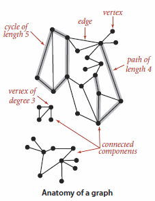

# Graphs

## _knows_ parallel edges and self-loops

The Graph definition allows two simple anomalies:

- A self-loop is an edge that connects a vertex to itself.
- Two edges that connect the same pair of vertices are parallel.

## is _able_ to explain graph anatomy; vertices, edges, cycles, paths, and degrees of vertices

A graph is a set of vertices and a collection of edges that each connect a pair of vertices.  
When there is an edge connecting two vertices, we say that the vertices are adjacent to one another and that the edge is incident to both vertices.  
The degree of a vertex is the number of edges incident to it.  
A subgraph is a subset of a graph’s edges (and associated vertices) that constitutes a graph. Many computational tasks involve identifying subgraphs of various types. Of particular interest are edges that take us through a sequence of vertices in a graph.  
A path in a graph is a sequence of vertices connected by edges. A simple path is one with no repeated vertices. A cycle is a path with at least one edge whose first and last vertices are the same. A simple cycle is a cycle with no repeated edges or vertices (except the requisite repetition of the first and last vertices). The length of a path or a cycle is its number of edges.  
A graph is connected if there is a path from every vertex to every other vertex in the graph. A graph that is not connected consists of a set of connected components, which are maximal connected subgraphs.  
A tree is an acyclic connected graph. A disjoint set of trees is called a forest. A spanning tree of a connected graph is a subgraph that contains all of that graph’s vertices and is a single tree. A spanning forest of a graph is the union of spanning trees of its connected components.

## is _able_ to implement a depth first search

## is _able_ to implement a breadth first search

## is _able_ to implement a Dijkstra’s algorithm

## have the _skills_ to select problems suitable for a graph solution

## _knows_ what a spanning tree is

## _knows_ the definition of a minimum spanning tree

## is _able_ to explain the properties of a minimum spanning tree

## is _able_ to explain Prim’s algorithm

## is _able_ to explain Kruskal’s algorithm

## _knows_ what a directed graph (digraph) is

## _knows_ what a shortest path tree is

## _knows_ the properties for a good heuristic

## _knows_ the A\* algorithm

## is _able_ to explain edge and vertex relaxation

## is _able_ to explain the shortest path optimality condition, and the generic shortest path algorithm

## is _able_ to implement Disjkstra’s algorithm for shortest path tree

## have the _skills_ to select the best shortest path algorithm for a given problem
