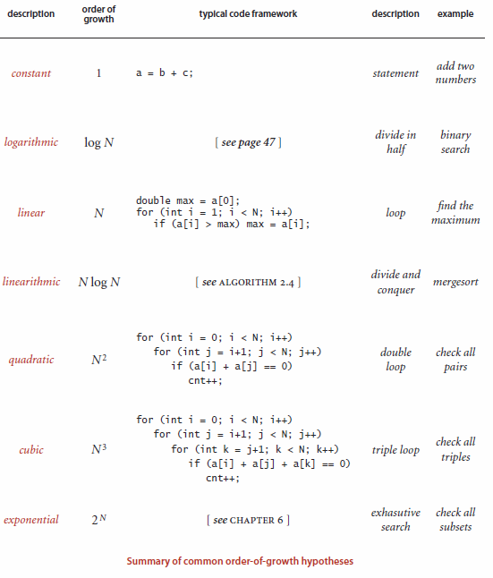
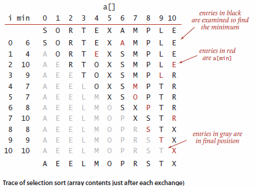
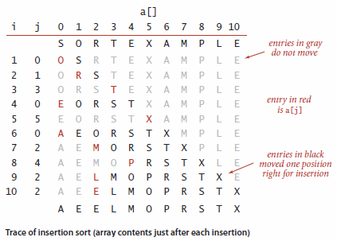
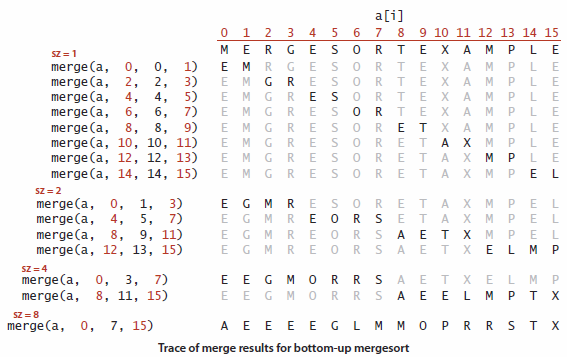
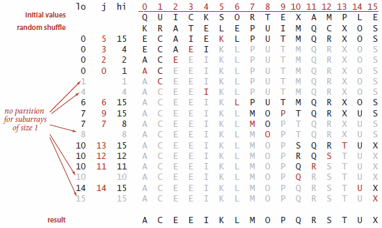
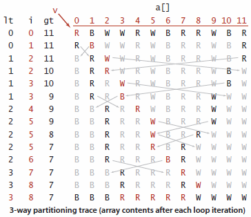
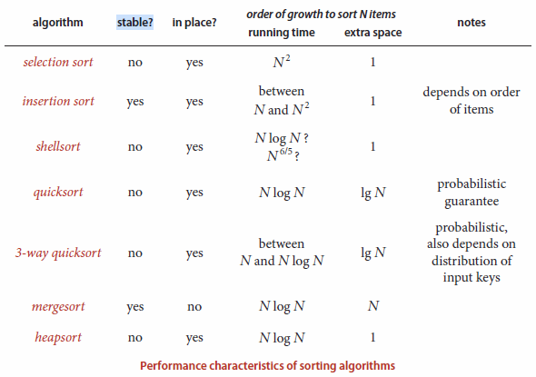
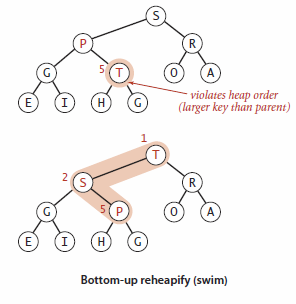
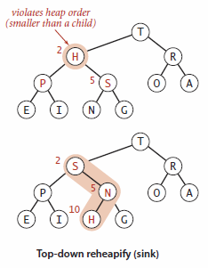

# Sorting

## _knows_ the basic data structures `Bag`, `Queue`, and `Stack`

| Method  | `Bag`       | `Queue`     | `Stack`     |
| ------- | ----------- | ----------- | ----------- |
| add     | `add()`     | `enqueue()` | `push()`    |
| remove  |             | `dequeue()` | `pop()`     |
| isEmpty | `isEmpty()` | `isEmpty()` | `isEmpty()` |
| size    | `getSize()` | `getSize()` | `getSize()` |

### `Bag`

A `Bag` is a collection where removing item is not supported, its purpose is to provide the ability to collect items and then iterate through the collected items. It also include the ability to test if the `Bag` is empty and find the number of items. The order of iteration is unspecified.  
In [`bag.py`](Implementations/bag.py) two implementations can be found, one that uses an `Array` to store the items, and one that uses a `Linked List`.

### `Queue`

A `Queue` is a collection that is based on the first-in-first-out policy. When iterating through a `Queue`, the items are processed in the order they where added to the `Queue`.  
In [`queue.py`](Implementations/queue.py) two implementations can be found, one that uses a `List` to store the items, and one that uses a `Linked List`.

### `Stack`

A `Stack` is a collection that is based on the last-in-first-out policy. When iterating through a `Stack`, the items are processed in reverse of the order in which they where added.  
In [`stack.py`](Implementations/stack.py) two implementations can be found, one that uses a `List` to store the items, and one that uses a `Linked List`.

## is _able_ to explain complexity in algorithms using big-O notation

### Order-of-growth

We use just a few structural primitives (statements, conditionals, loops, nesting, and method calls) to implement algorithms, so very often the order of growth of the cost is one of just a few functions of the problem size N.

- **Constant**: A program whose running time’s order of growth is constant executes a fixed number of operations to finish its job; consequently its running time does not depend on N.
- **Logarithmic**: A program whose running time’s order of growth is logarithmic is barely slower than a constant-time program. The classic example of a program whose running time is logarithmic in the problem size is binary search. The base of the logarithm is not relevant with respect to the order of growth, so we use log N when referring to order of growth.
- **Linear**: Programs that spend a constant amount of time processing each piece of input data, or that are based on a single for loop, are quite common. The order of growth of such a program is said to be linear and its running time is proportional to N.
- **Linearithmic**: We use the term linearithmic to describe programs whose running time for a problem of size N has order of growth N log N. Again, the base of the logarithm is not relevant with respect to the order of growth. The prototypical examples of linearithmic algorithms are [Merge Sort](#Merge-Sort) and [Quick Sort](#Quick-Sort).
- **Quadratic**: A typical program whose running time has order of growth N2 has two nested for loops, used for some calculation involving all pairs of N elements. The elementary sorting algorithms [Selection Sort](#_knows_-selection-sort-and-its-complexity) and [Insertion Sort](#is-_able_-to-implement-insertion-sort-and-knows-its-complexity) are prototypes of the programs in this classification.
- **Cubic**: A typical program whose running time has order of growth N3 has three nested for loops, used for some calculation involving all triples of N elements.
- **Exponential**: We use the term exponential to refer to algorithms whose order of growth is bN for any constant b > 1, even though different values of b lead to vastly different running times. Exponential algorithms are extremely slow and you will never run one of them to completion for a large problem. Exponential algorithms play a critical role in the theory of algorithms because there exists a large class of problems for which it seems that an exponential algorithm is the best possible choice.

## have the _skills_ to select the best implementation of simple data structures

## _knows_ selection sort and its complexity

1.  set the first item in the unsorted array as minimum
2.  find minimum in the rest of the unsorted array
3.  swap the first item with minimum
4.  repeat until index equals length

Time Complexity

|    Best Case     |   Average Case   |    Worst Case    |
| :--------------: | :--------------: | :--------------: |
| O(n2) | O(n2) | O(n2) |

In [`sorting.py`](Implementations/sorting.py) an implementation of Selection Sort can be found.

## is _able_ to implement insertion sort and knows its complexity

The algorithm that people often use to sort bridge hands is to consider the cards one at a time, inserting each into its proper place among those already considered (keeping them sorted). In a computer implementation, we need to make space to insert the current item by moving larger items one position to the right, before inserting the current item into the vacated position.  
As in Selection Sort, the items to the left of the current index are in sorted order during the sort, but they are not in their final position, as they may have to be moved to make room for smaller items encountered later. The array is, however, fully sorted when the index reaches the right end.  
Unlike that of Selection Sort, the running time of insertion sort depends on the initial order of the items in the input.

Time Complexity

| Best Case |   Average Case   |    Worst Case    |
| :-------: | :--------------: | :--------------: |
|   O(n)    | O(n2) | O(n2) |

In [`sorting.py`](Implementations/sorting.py) an implementation of Insertion Sort can be found.

## _knows_ the concept of divide and conquer algorithms and their complexity

Time Complexity

| Algorithm  | Best Case  | Average Case |    Worst Case    |
| :--------: | :--------: | :----------: | :--------------: |
| Merge Sort | O(n log n) |  O(n log n)  |    O(n log n)    |
| Quick Sort | O(n log n) |  O(n log n)  | O(n2) |

### Merge Sort

**Merge Sort**: to sort an array, divide it into two halves, sort the two halves (recursively), and then merge the results. As you will see, one of Merge Sort’s most attractive properties is that it guarantees to sort any array of N items in time proportional to N log N. Its prime disadvantage is that it uses extra space proportional to N.

#### In-place merging

The straightforward approach to implementing merging is to design a method that merges two disjoint ordered arrays of Comparable objects into a third array. This strategy is easy to implement: create an output array of the requisite size and then choose successively the smallest remaining item from the two input arrays to be the next item added to the output array.  
However, when we Merge Sort a large array, we are doing a huge number of merges, so the cost of creating a new array to hold the output every time that we do a merge is problematic. It would be much more desirable to have an in-place method so that we could sort the first half of the array in place, then sort the second half of the array in place, then do the merge of the two halves by moving the items around within the array, without using a significant amount of other extra space.

#### Top-down

Top-down Merge Sort is a recursive Merge Sort implementation based on this abstract inplace merge. It is one of the best-known examples of the utility of the divide-and-conquer paradigm for efficient algorithm design.  
In [`sorting.py`](Implementations/sorting.py) an implementation of Top-down Merge Sort can be found.

##### Optimizations

###### Use insertion sort for small sub arrays

We can improve most recursive algorithms by handling small cases differently, because the recursion guarantees that the method will be used often for small cases, so improvements in handling them lead to improvements in the whole algorithm. In the case of sorting, we know that insertion sort (or selection sort) is simple and therefore likely to be faster than Merge Sort for tiny sub arrays. Switching to insertion sort for small sub arrays (length 15 or less, say) will improve the running time of a typical Merge Sort implementation by 10 to 15 percent.

###### Test whether the array is already in order

We can reduce the running time to be linear for arrays that are already in order by adding a test to skip the call to `merge()` if `a[mid]` is less than or equal to `a[mid+1]`. With this change, we still do all the recursive calls, but the running time for any sorted subarray is linear.

#### Bottom-up

Another way to implement Merge Sort is to organize the merges so that we do all the merges of tiny sub arrays on one pass, then do a second pass to merge those sub arrays in pairs, and so forth, continuing until we do a merge that encompasses the whole array. This method requires even less code than the standard recursive implementation.  
In [`sorting.py`](Implementations/sorting.py) an implementation of Bottom-up Merge Sort can be found.

### Quick Sort

Quick Sort is a divide-and-conquer method for sorting. It works by partitioning an array into two sub arrays, then sorting the sub arrays independently. Quick Sort is complementary to Merge Sort: for Merge Sort, we break the array into two sub arrays to be sorted and then combine the ordered sub arrays to make the whole ordered array; for Quick Sort, we rearrange the array such that, when the two sub arrays are sorted, the whole array is ordered. In the first instance, we do the two recursive calls before working on the whole array; in the second instance, we do the two recursive calls after working on the whole array. For Merge Sort, the array is divided in half; for Quick Sort, the position of the partition depends on the contents of the array.  
The crux of the method is the partitioning process, which rearranges the array to make the following three conditions hold:

- The entry `a[j]` is in its fi nal place in the array, for some `j`.
- No entry in `a[lo]` through `a[j-1]` is greater than `a[j]`.
- No entry in `a[j+1]` through `a[hi]` is less than `a[j]`.

We achieve a complete sort by partitioning, then recursively applying the method.  
In [`sorting.py`](Implementations/sorting.py) an implementation of Quick Sort can be found.

#### 3-way partitioning

Arrays with large numbers of duplicate sort keys arise frequently in applications. In such applications, there is potential to reduce the time of the sort from linearithmic to linear. One straightforward idea is to partition the array into three parts, one each for items with keys smaller than, equal to, and larger than the partitioning item's key.  
In [`sorting.py`](Implementations/sorting.py) an implementation of Quick Sort 3-way partition can be found.

## _knows_ the difference between time and space complexity

Given the size of the input, how many steps will the algorithm need to perform before it gives an answer (assuming that it terminates)? This is the time complexity.  
Given the size of the input, how much storage does the algorithm need while working, i.e. performing all those steps? This is the space complexity.

## _knows_ what defines a stable sorting algorithm

A sorting method is stable if it preserves the relative order of equal keys in the array. This property is frequently important.  
For example, consider an internet commerce application where we have to process a large number of events that have locations and timestamps. To begin, suppose that we store events in an array as they arrive, so they are in order of the timestamp in the array. Now suppose that the application requires that the transactions be separated out by location for further processing. One easy way to do so is to sort the array by location. If the sort is unstable, the transactions for each city may not necessarily be in order by timestamp after the sort.  
Often, programmers who are unfamiliar with stability are surprised, when they first encounter the situation, by the way an unstable algorithm seems to scramble the data. Some of the sorting methods that we have considered in this chapter are stable ( insertion sort and mergesort); many are not (selection sort, shellsort, quicksort, and heapsort).

## have the _skills_ to choose the right algorithm for a problem, based on stability and complexities

## _knows_ the purpose of `sink` and `swim` functions

### Bottom-up reheapify - `swim`

If the heap order is violated because a node’s key becomes larger than that node’s parent’s key, then we can make progress toward fixing the violation by exchanging the node with its parent.  
After the exchange, the node is larger than both its children (one is the old parent, and the other is smaller than the old parent because it was a child of that node) but the node may still be larger than its parent.  
We can fix that violation in the same way, and so forth, moving up the heap until we reach a node with a larger key, or the root.  
Coding this process is straightforward when you keep in mind that the parent of the node at position k in a heap is at position k/2. The loop in swim() preserves the invariant that the only place the heap order could be violated is when the node at position k might be larger than its parent. Therefore, when we get to a place where that node is not larger than its parent, we know that the heap order is satisfied throughout the heap.  
To justify the method’s name, we think of the new node, having too large a key, as having to swim to a higher level in the heap.

### Top-down reheapify - `sink`

If the heap order is violated because a node’s key becomes smaller than one or both of that node’s children’s keys, then we can make progress toward fixing the violation by exchanging the node with the larger of its two children.  
This switch may cause a violation at the child; we fix that violation in the same way, and so forth, moving down the heap until we reach a node with both children smaller (or equal), or the bottom.  
The code again follows directly from the fact that the children of the node at position k in a heap are at positions 2k and 2k+1.  
To justify the method’s name, we think about the node, having too small a key, as having to sink to a lower level in the heap.

## is _able_ to explain heaps and head sort

We represent a heap of size `N` in private array `pq[]` of length `N + 1`, with `pq[0]` unused and the heap in `pq[1]` through `pq[N]`. As for sorting algorithms, we access keys only through private helper functions `less()` and `exch()`, but since all items are in the instance variable `pq[]`, we use the more compact implementations on the next page that do not involve passing the array name as a parameter.  
The heap operations that we consider work by first making a simple modification that could violate the heap condition, then traveling through the heap, modifying the heap as required to ensure that the heap condition is satisfied everywhere. We refer to this process as reheapifying, or restoring heap order.
There are two cases:

- When the priority of some node is increased (or a new node is added at the bottom of a heap), we have to travel up the heap to restore the heap order.
- When the priority of some node is decreased (for example, if we replace the node at the root with a new node that has a smaller key), we have to travel down the heap to restore the heap order. First, we will consider how to implement these two basic auxiliary operations; then, we shall see how to use them to implement insert and remove the maximum.

## have the _skills_ to choose the right priority queue implementation
