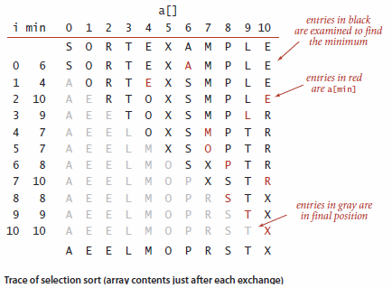
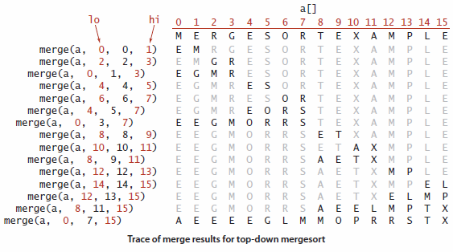
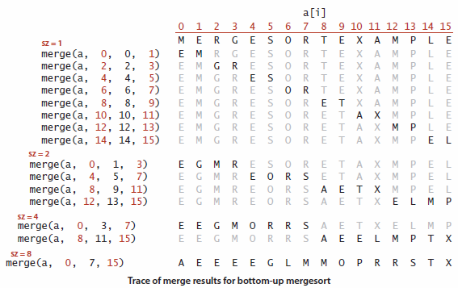
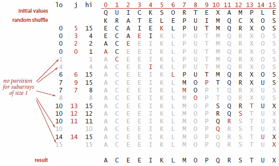
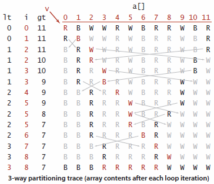

# Sorting

## Knowledge

### _knows_ the basic data structures `Bag`, `Queue`, and `Stack`

| Method  | `Bag`       | `Queue`     | `Stack`     |
|---------|-------------|-------------|-------------|
| add     | `add()`     | `enqueue()` | `push()`    |
| remove  |             | `dequeue()` | `pop()`     |
| isEmpty | `isEmpty()` | `isEmpty()` | `isEmpty()` |
| size    | `getSize()` | `getSize()` | `getSize()` |

#### `Bag`

A `Bag` is a collection where removing item is not supported, its purpose is to provide the ability to collect items
and then iterate through the collected items. It also include the ability to test if the `Bag` is empty and find the
number of items. The order of iteration is unspecified.  
In [`bag.py`](Implementations/bag.py) two implementations can be found, one that uses an `Array` to store the items,
and one that uses a `Linked List`.

#### `Queue`

A `Queue` is a collection that is based on the first-in-first-out policy. When iterating through a `Queue`, the items
are processed in the order they where added to the `Queue`.  
In [`queue.py`](Implementations/queue.py) two implementations can be found, one that uses a `List` to store the items,
and one that uses a `Linked List`.

#### `Stack`

A `Stack` is a collection that is based on the last-in-first-out policy. When iterating through a `Stack`, the items
are processed in reverse of the order in which they where added.  
In [`stack.py`](Implementations/stack.py) two implementations can be found, one that uses a `List` to store the items,
and one that uses a `Linked List`.

### _knows_ selection sort and its complexity

1. set the first item in the unsorted array as minimum
2. find minimum in the rest of the unsorted array
3. swap the first item with minimum
4. repeat until index equals length

Time Complexity

| Best Case        | Average Case     | Worst Case       |
|:----------------:|:----------------:|:----------------:|
| O(n2) | O(n2) | O(n2) |

In [`sorting.py`](Implementations/sorting.py) an implementation of Selection Sort can be found.

### _knows_ the concept of divide and conquer algorithms and their complexity

Time Complexity

| Algorithm  | Best Case  | Average Case | Worst Case       |
|:----------:|:----------:|:------------:|:----------------:|
| Merge Sort | O(n log n) | O(n log n)   | O(n log n)       |
| Quick Sort | O(n log n) | O(n log n)   | O(n2) |

#### Merge Sort

Merge Sort: to sort an array, divide it into two halves, sort the two halves (recursively), and then merge the results.
As you will see, one of Merge Sort’s most attractive properties is that it guarantees to sort any array of `N` items in
time proportional to `N log N`. Its prime disadvantage is that it uses extra space proportional to `N`.

##### Top-down

##### Bottom-up

#### Quick Sort

##### 3-way partitioning

### _knows_ the difference between time and space complexity

### _knows_ what defines a stable sorting algorithm

### _knows_ the purpose of `sink` and `swim` functions

## Abilities

### is _able_ to explain complexity in algorithms using big-O notation

### is _able_ to implement insertion sort and knows its complexity

### is _able_ to explain heaps and head sort

## Skills

### have the _skills_ to select the best implementation of simple data structures

### have the _skills_ to choose the right algorithm for a problem, based on stability and complexities

### have the _skills_ to choose the right priority queue implementation
